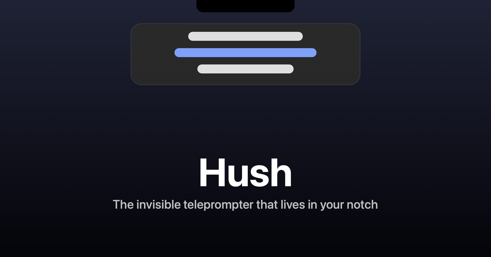

# Hush

**An invisible, voice-following teleprompter that lives in your MacBook notch.**

Free and open source. Everything runs on your Mac.

---

Your script sits right under the camera, so your eyes stay on the lens. It scrolls as you
speak, and it is **invisible during screen sharing**. Zoom, Meet, Teams, OBS, and QuickTime
never see it. No account, no cloud, no telemetry.

> The name reads two ways: English *hush* (quiet, hidden from the call) and Kurdish (Kurmancî)
> *hiş* (mind, presence of mind).

## Quick start

1. Download **Hush.dmg** from [Releases](https://github.com/happyhackingspace/hush/releases),
   open it, and drag Hush to **Applications**.
2. Launch it. The build is unsigned, so the first time macOS blocks it: open
   **System Settings > Privacy & Security**, find the "Hush was blocked" notice, and click
   **Open Anyway**. You only do this once.
3. Paste or type your script, press **Start**, and read from the notch.

That's it. Turn on **Voice follow** to have it scroll as you speak.

## What it does

- **Invisible to screen sharing**: visible to you, never to the call.
- **Three ways to scroll**: by your **voice** (word-level highlight that recovers if you go
  off script), at a steady **speed**, or **manually** by trackpad.
- **Hands-free control**: **hand gestures** (✋ play/pause, ☝️ scroll up, ✌️ scroll down),
  **voice commands** ("hush pause / next / back"), and keyboard / global hotkeys.
- **AI script tools**: tighten, rewrite, fix grammar, shorten, and translate on device.
- **Record**: capture takes from your camera and mic, with live captions.
- **Markdown**: full support, including headings, lists, blockquotes, code blocks, and rules,
  plus inline bold, italic, strikethrough, and code.
- **Cues**: `[pause] [breathe] [smile] [slow] [emphasis]` shown as markers, skipped by voice.
- **Accessibility**: high-contrast themes, big/bold text, focus dimming, captions, hand and
  keyboard control, and respect for Reduce Motion, Reduce Transparency, and VoiceOver.

## Install

**Direct download** (available now): grab `Hush.dmg` from
[Releases](https://github.com/happyhackingspace/hush/releases) and drag it to Applications.
The build is unsigned, so clear the first-launch block once via **System Settings > Privacy &
Security > Open Anyway**, or by running `xattr -dr com.apple.quarantine /Applications/Hush.app`.
After that it opens normally.

**Homebrew** (once the cask is published): `brew install --cask --no-quarantine hush`.

## Contributing

Contributions are welcome. See [CONTRIBUTING.md](CONTRIBUTING.md) for how to build, test, and
submit changes.

## License

MIT. See [LICENSE](LICENSE).

---

Made with ❤️ by <a href="https://github.com/happyhackingspace">Happy Hacking Space</a>

